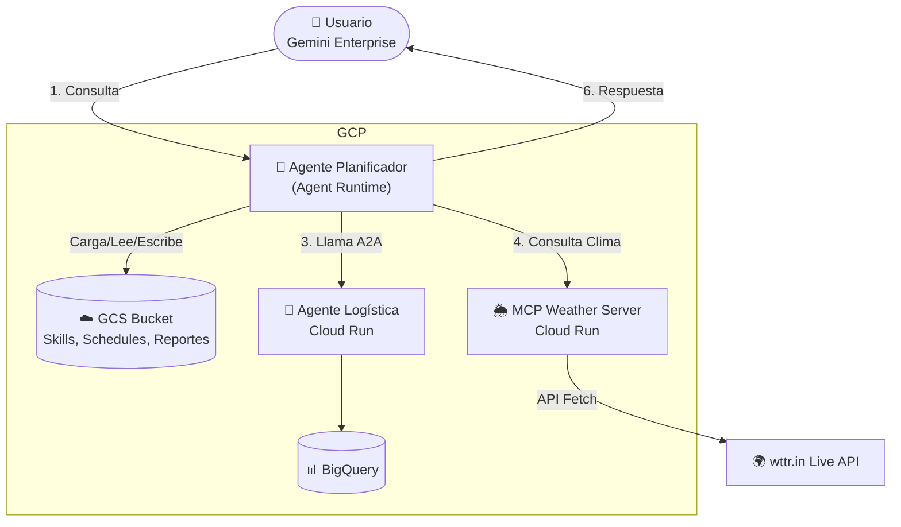

# factory-planner (Planificador de Fábrica)

Agente inteligente orquestador de cadena de suministro basado en ReAct utilizando el **Google Agent Development Kit (ADK)** y compatible con el protocolo **Agent-to-Agent (A2A)**.

---

## ¿Qué hace este agente?

`factory_planner` es un agente experto diseñado para validar de manera inteligente si un lote de producción industrial puede iniciarse. Su toma de decisiones se basa rigurosamente en la combinación de tres coordenadas de información obtenidas en tiempo real:

1.  **Cronogramas de la Flota Local (`production_schedule.json`):** Consulta un archivo JSON local (sincronizado con datos reales de la tabla de BigQuery `dvt-sp-agentspace.dev_dataset.containers`) para descubrir qué contenedores están en ruta, sus puertos de origen (pol), puertos de destino (pod), fechas estimadas (eta) y transportistas (carriers).
2.  **Riesgo Climático en Tiempo Real mediante MCP (`get_port_weather`):** Llama a un servidor del protocolo **Model Context Protocol (MCP)** desarrollado en Node.js que realiza peticiones HTTP en tiempo real a la API meteorológica global de **wttr.in** para evaluar de forma dinámica si existen tormentas, vendavales o alertas climáticas que pongan en peligro el transporte marítimo desde el puerto de carga.
3.  **Detalles de Carga Avanzados vía A2A (`logistics_agent`):** Utiliza la interconexión nativa de A2A de Google ADK para comunicarse de manera remota con el agente de logística **`LogisticsFix`** (desplegado en Cloud Run). El agente resuelve si el contenedor con materia prima tiene sus trámites de aduana aprobados, peso correcto y contenido apto.

**Regla de Oro:** Basado en estos tres puntos, el planificador genera una recomendación final detallada en castellano. Si alguna de las herramientas de consulta falla o no tiene conexión, el agente **nunca inventa datos** y te lo comunicará de manera transparente.

---

## 🔌 Detalle del Servidor MCP: Envolviendo la Web para el LLM

En este caso, el **servidor MCP** se ha definido como un **"wrapper" (envolvedor) de APIs o Webs**. Este proyecto implementa un servidor MCP real en **Node.js** que envuelve la API meteorológica global de **wttr.in** y la traduce al estándar abierto de comunicación JSON-RPC 2.0.

### ¿Por qué Gemini necesita que hagamos este Wrapper (MCP)?
Un modelo de lenguaje (como Gemini 2.5 Flash) es inteligente pero tiene limitaciones físicas en producción:
1.  **Sin navegación libre:** No queremos que navegue por internet de forma autónoma para buscar el clima pues podría alucinar y/o incurrir en un gasto de tokens superfluo.
2.  **Saturación de Contexto:** Las APIs meteorológicas devuelven JSONs enormes con miles de líneas de datos brutos. Enviar todo ese JSON al LLM desperdicia tokens y ralentiza la respuesta. El MCP filtra la información y envía solo los parámetros clave (Temperatura, Viento, Humedad).
3.  **Lógica y Fórmulas Locales:** El LLM no sabe calcular de forma determinista si una racha de viento de 45 km/h representa un peligro alto para un buque portacontenedores. **Nuestro servidor MCP de Node.js procesa las métricas reales y calcula el nivel de riesgo de transporte de forma matemática**, entregándole al LLM el resultado ya masticado (`LOW`, `MEDIUM`, `HIGH`).

### Los Tres Archivos de la Ingeniería MCP en el Proyecto:
1.  **La Declaración (`mcp_config.json`):** El manifiesto en la raíz del proyecto que le indica a la ADK que debe levantar el subproceso de Node en Cloud Run:
    ```json
    "weather-server": { "command": "node", "args": [".../weather-server/index.js"] }
    ```
2.  **El Wrapper de Node.js (`weather-server/index.js`):** Escucha las peticiones por stdio utilizando JSON-RPC 2.0, realiza la petición HTTP real de red a `wttr.in` en tiempo real, clasifica el riesgo usando métricas meteorológicas en vivo, y cuenta con un fallback local resiliente en caso de desconexión.
3.  **La Inyección de Habilidad en Python (`app/agent.py`):** Utiliza la clase `McpToolset` de Google ADK para conectar de manera transparente el subproceso de Node e inyectarle la habilidad climática `get_port_weather` directamente a la lista de herramientas de Gemini.

---

## 🗺️ Diagrama de Arquitectura del Agente

A continuación se muestra el flujo de orquestación técnica que realiza el agente `factory_planner` utilizando **Google ADK 2.1.0** para validar el lote de producción:



---

## Estructura del Proyecto

```
factory-planner/
├── app/                      # Código principal del agente
│   ├── agent.py                 # Lógica de razonamiento, tools y callbacks del agente (Boilerplate)
│   ├── agent_runtime_app.py      # Envoltorio del agente para Agent Runtime de GCP
│   ├── logistics_agent_card.json # Agent Card del servicio remoto de Logística A2A
│   └── app_utils/               # Utilidades de telemetría y tipado del ADK
├── skills/                   # Directorio de Habilidades (Skills) Dinámicas en Markdown
│   └── weather_report_skill.md  # Instrucciones expertas para generación de reportes climáticos
├── weather-server/           # Servidor MCP de Clima Real (Node.js stdio)
│   └── index.js                 # Manejador JSON-RPC 2.0 y consultas HTTP a wttr.in
├── DEPLOY_GCP.md             # Guía detallada para despliegue y registro en GCP
├── GEMINI.md                 # Guía para el agente de desarrollo de IA (Gemini CLI/Antigravity)
├── setup.sh                  # Script de configuración automatizado para Cloud Shell Editor
├── mcp_config.json           # Configuración del servidor MCP 
├── production_schedule.json  # Datos locales de contenedores activos (Placeholder para el taller)
└── pyproject.toml            # Dependencias del proyecto Python
```

---

## 💡 Arquitectura de Habilidades (Skills) y Configuración en la Nube

Para demostrar las capacidades completas de **Google ADK 2.1.0** en entornos de gran escala, este proyecto implementa una arquitectura 100% serverless, desacoplada y orientada a la seguridad:

*   **Habilidades Dinámicas desde Google Cloud Storage (GCS):**
    *   Los manuales de habilidades (como `skills/weather_report_skill.md`) se almacenan de forma segura en el bucket **`gs://dvt-sp-agentspace-factory-skills`**.
    *   **Lazy Loading asíncrono:** Al iniciar la conversación, el agente realiza una importación tardía diferida para descargar las habilidades de GCS en memoria de forma segura dentro del event loop de FastAPI.
*   **Cronograma de Flota Dinámico en la Nube:**
    *   La base de datos de contenedores activos se lee directamente desde **`gs://dvt-sp-agentspace-factory-skills/production_schedule.json`**.
    *   **¡Súper dinámico!:** Puedes actualizar los barcos o puertos editando directamente el JSON en el bucket de GCS, y el agente en producción leerá los cambios de inmediato sin tener que realizar ningún despliegue de código.
*   **Seguridad y Autenticación de Extremo a Extremo (OIDC Bearer Token):**
    *   El servidor MCP del clima en **Cloud Run** está configurado de forma **100% privada** (`--no-allow-unauthenticated`).
    *   Durante la ejecución del tool, el agente de Python genera dinámicamente un **OIDC Identity Token de Google** desde las credenciales por defecto de su Service Account (o gcloud en local) e inyecta la cabecera `Authorization: Bearer <TOKEN>` para autorizarse contra Cloud Run de forma segura.
*   **Reportes Climáticos en la Nube con Enlace de Descarga Directo:**
    *   La herramienta `save_markdown_report` sube de forma pública el reporte Markdown generado a la carpeta `/reports/` de tu bucket de GCS.
    *   Retorna un enlace público clickeable (`download_url`). Gemini lee esta URL e **inyecta de forma nativa en el chat un botón de descarga directo** (ej: `[📥 Descargar Reporte en GCS](url_generada)`) para que el usuario pueda guardarlo en su PC con un solo clic.

---

## 📡 Modo Offline / Local-First (Cero Configuración para Pruebas Rápidas)

Este proyecto está diseñado para ser **Local-First**, permitiendo a cualquier desarrollador o probador ejecutar y validar todo el comportamiento del agente de forma **100% local y offline**, sin necesidad de configurar credenciales de Google Cloud ni instalar dependencias externas.

### ¿Cómo activarlo?
Simplemente configura la siguiente variable en tu archivo `.env`:
```env
OFFLINE_MODE=true
```

### ¿Qué hace el Modo Offline tras bambalinas?
Cuando esta variable es `true`, el agente inteligente de Python activa un protocolo de contingencia local:
1.  **Skills e Instrucciones locales:** En lugar de intentar conectarse a internet para descargar las habilidades de GCS, las lee de forma instantánea y local desde la carpeta `skills/`.
2.  **Cronogramas Locales:** Bypassea GCS y lee el cronograma de barcos directamente desde el archivo local `production_schedule.json`.
3.  **Simulación Climática Determinista:** El agente no requiere el microservicio de Cloud Run ni genera tokens de GCP. Consulta de forma interna un diccionario meteorológico local de alta fidelidad, respondiendo con el clima y el riesgo físico exacto al instante.
4.  **Guardado Local:** Omite la subida a internet y guarda el informe Markdown físico en tu disco local dentro de la carpeta `reports/`.

---

## 🚀 Inicialización Rápida en Cloud Shell

Para simplificar al máximo el arranque en los talleres, puedes utilizar el script de configuración automatizado.

Ejecuta el siguiente comando en la terminal para instalar todas las dependencias, herramientas del CLI, inicializar el entorno y autenticarte en Google Cloud:
```bash
chmod +x setup.sh && ./setup.sh
```

---

## Requisitos Previos (Instalación Manual)

Si prefieres no usar el script automático, asegúrate de tener instalado:
*   **uv**: Gestor de paquetes de Python de alto rendimiento - [Instalar uv](https://docs.astral.sh/uv/getting-started/installation/)
*   **agents-cli**: CLI oficial de agentes de Google - Instálalo ejecutando: `uv tool install google-agents-cli`
*   **Google Cloud SDK**: Para los servicios e integraciones en la nube - [Instalar gcloud](https://cloud.google.com/sdk/docs/install)
*   **Node.js (v18+)**: Para la ejecución del servidor meteorológico MCP.

---

## Comandos del Proyecto

Ejecuta estos comandos desde la carpeta raíz del proyecto (`factory-planner`):

| Comando | Descripción |
| :--- | :--- |
| `./setup.sh` | Ejecuta la inicialización automática para talleres en Cloud Shell. |
| `agents-cli install` | Instala todas las dependencias del proyecto en un entorno virtual aislado (`.venv`) usando `uv`. |
| `uv run adk run app` | **Inicia el agente en modo consola interactiva** (ideal para pruebas locales rápidas). |
| `uv run adk web --port 8080 .` | Lanza el Web UI interactivo (Playground visual) directo de la ADK en el puerto `8080`. |
| `agents-cli deploy` | Empaqueta y despliega el agente en **Agent Runtime** de Google Cloud. |
| `agents-cli publish gemini-enterprise` | Registra el agente y expone sus **skills** en la consola de **Gemini Enterprise**. |

---

## Pruebas y Desarrollo Local

1.  **Inicializa el entorno:**
    ```bash
    # Utiliza el script para resolver todo automáticamente:
    ./setup.sh
    ```

2.  **Prueba el agente de forma directa en terminal:**
    ```bash
    uv run adk run app
    ```

3.  **Prueba interactiva web:**
    ```bash
    uv run adk web --port 8080 .
    ```

---

## Despliegue en la Nube de Google (GCP)

Toda la documentación técnica para realizar el despliegue del agente en **Reasoning Engines** y registrar de manera oficial sus **Skills** en **Gemini Enterprise Agent Platform** está documentada en el archivo [DEPLOY_GCP.md](./DEPLOY_GCP.md).
