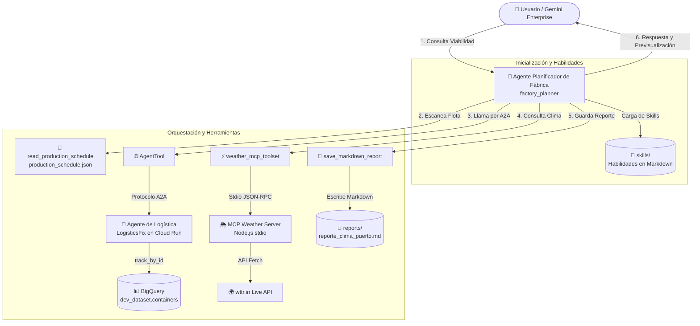

# factory-planner (Planificador de Fábrica)

Agente inteligente orquestador de cadena de suministro basado en ReAct utilizando el **Google Agent Development Kit (ADK)** y compatible con el protocolo **Agent-to-Agent (A2A)**.

---

## ¿Qué hace este agente?

`factory_planner` es un agente experto diseñado para validar de manera inteligente si un lote de producción industrial puede iniciarse. Su toma de decisiones se basa rigurosamente en la combinación de tres coordenadas de información obtenidas en tiempo real:

1.  **Cronogramas de la Flota Local (`production_schedule.json`):** Consulta un archivo JSON local (sincronizado con datos reales de la tabla de BigQuery `dvt-sp-agentspace.dev_dataset.containers`) para descubrir qué contenedores están en ruta, sus puertos de origen (pol), puertos de destino (pod), fechas estimadas (eta) y transportistas (carriers).
2.  **Riesgo Climático en Tiempo Real mediante MCP (`get_port_weather`):** Llama a un servidor del protocolo **Model Context Protocol (MCP)** desarrollado en Node.js que realiza peticiones HTTP en tiempo real a la API meteorológica global de **wttr.in** para evaluar de forma dinámica si existen tormentas, vendavales o alertas climáticas que pongan en peligro el transporte marítimo desde el puerto de carga.
3.  **Detalles de Carga Avanzados vía A2A (`logistics_agent`):** Utiliza la interconexión nativa de A2A de Google ADK para comunicarse de manera remota con el agente de logística **`LogisticsFix`** (desplegado en Cloud Run en la dirección `https://<LOGISTICS_AGENT_URL>`). El agente resuelve si el contenedor con materia prima tiene sus trámites de aduana aprobados, peso correcto y contenido apto.

**Regla de Oro:** Basado en estos tres puntos, el planificador genera una recomendación final detallada en castellano. Si alguna de las herramientas de consulta falla o no tiene conexión, el agente **nunca inventa datos** y te lo comunicará de manera transparente.

---

## 🗺️ Diagrama de Arquitectura del Agente

A continuación se muestra el flujo de orquestación técnica que realiza el agente `factory_planner` utilizando **Google ADK 2.1.0** para validar el lote de producción:



---

## Estructura del Proyecto

```
factory-planner/
├── app/                      # Código principal del agente
│   ├── agent.py                 # Lógica de razonamiento, tools y callbacks del agente
│   ├── agent_runtime_app.py      # Envoltorio del agente para Agent Runtime de GCP
│   ├── logistics_agent_card.json # Agent Card del servicio remoto de Logística A2A
│   └── app_utils/               # Utilidades de telemetría y tipado del ADK
├── skills/                   # Directorio de Habilidades (Skills) Dinámicas en Markdown
│   └── weather_report_skill.md  # Instrucciones expertas para generación de reportes climáticos
├── weather-server/           # Servidor MCP de Clima Real (Node.js stdio)
│   └── index.js                 # Manejador JSON-RPC 2.0 y consultas HTTP a wttr.in
├── tests/                    # Pruebas unitarias, integración y evaluación
├── DEPLOY_GCP.md             # Guía detallada para despliegue y registro en GCP
├── GEMINI.md                 # Guía para el agente de desarrollo de IA (Gemini CLI)
├── mcp_config.json           # Configuración del servidor MCP local
├── production_schedule.json  # Datos locales de contenedores activos
└── pyproject.toml            # Dependencias del proyecto Python
```

---

## 💡 Arquitectura de Skills Modulares (Habilidades Dinámicas)

Para mostrar las posibilidades completas de **Google ADK**, este proyecto implementa una arquitectura avanzada de **Skills Modulares** inspirada en las habilidades de agentes expertos de Gemini:

*   **¿Cómo funciona?** Al arrancar el agente, una función dinámica en `app/agent.py` escanea recursivamente el directorio `skills/` y lee de forma automática cualquier archivo `.md` (Markdown). Estas directivas de nivel experto son inyectadas limpiamente como parte del prompt del sistema del agente (`instruction`).
*   **Modularidad sin código:** Esto te permite arrastrar, renombrar, añadir o remover habilidades completas simplemente gestionando archivos `.md` en la carpeta `skills/` sin tener que alterar una sola línea del código de Python del agente.

### Habilidades Incluidas:
1.  **Habilidad de Reportes Climáticos Marítimos Profesionales (`skills/weather_report_skill.md`):**
    *   **Propósito:** Enseña al agente el protocolo estricto y la estructura visual para redactar reportes climáticos profesionales en formato Markdown cuando el usuario le pide evaluar el clima o dar recomendaciones.
    *   **Acción Física:** Enseña al agente cómo interactuar de forma segura con la herramienta de infraestructura de disco `save_markdown_report` para persistir físicamente los reportes en un directorio local llamado `reports/` (ej: `reports/reporte_clima_buenos_aires.md`), ofreciendo al usuario una previsualización atractiva en el chat de su ejecución.

---

## Requisitos Previos

Antes de comenzar, asegúrate de tener instalado:
*   **uv**: Gestor de paquetes de Python de alto rendimiento - [Instalar uv](https://docs.astral.sh/uv/getting-started/installation/)
*   **agents-cli**: CLI oficial de agentes de Google - Instálalo ejecutando: `uv tool install google-agents-cli`
*   **Google Cloud SDK**: Para los servicios e integraciones en la nube - [Instalar gcloud](https://cloud.google.com/sdk/docs/install)
*   **Node.js (v18+)**: Para la ejecución del servidor meteorológico MCP.

---

## Comandos del Proyecto

Ejecuta estos comandos desde la carpeta raíz del proyecto (`factory-planner`):

| Comando | Descripción |
| :--- | :--- |
| `agents-cli install` | Instala todas las dependencias del proyecto en un entorno virtual aislado (`.venv`) usando `uv`. |
| `uv run adk run app` | **Inicia el agente en modo consola interactiva** (ideal para pruebas locales rápidas). |
| `agents-cli playground` | Lanza el entorno de desarrollo y pruebas interactivo web (auto-recarga al guardar). |
| `uv run pytest tests/unit` | Ejecuta la suite de pruebas unitarias de las herramientas locales. |
| `agents-cli deploy` | Empaqueta y despliega el agente en **Agent Runtime** de Google Cloud. |
| `agents-cli publish gemini-enterprise` | Registra el agente y expone sus **skills** en la consola de **Gemini Enterprise**. |

---

## Pruebas y Desarrollo Local

1.  **Instala las dependencias:**
    ```bash
    agents-cli install
    ```

2.  **Prueba el agente de forma directa en terminal:**
    ```bash
    uv run adk run app
    ```
    *Escribe consultas como:*
    > *"¿Puedes validar si el contenedor CMDU4651065 está listo para que iniciemos el lote de producción?"*

3.  **Prueba interactiva web:**
    ```bash
    agents-cli playground
    ```

---

## Despliegue en la Nube de Google (GCP)

Toda la documentación técnica para realizar el despliegue del agente en **Reasoning Engines** y registrar de manera oficial sus **Skills** en **Gemini Enterprise Agent Platform** está documentada en el archivo [DEPLOY_GCP.md](./DEPLOY_GCP.md).
